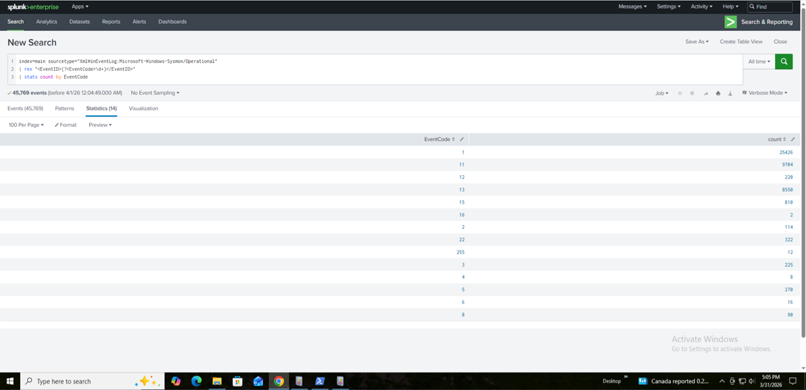
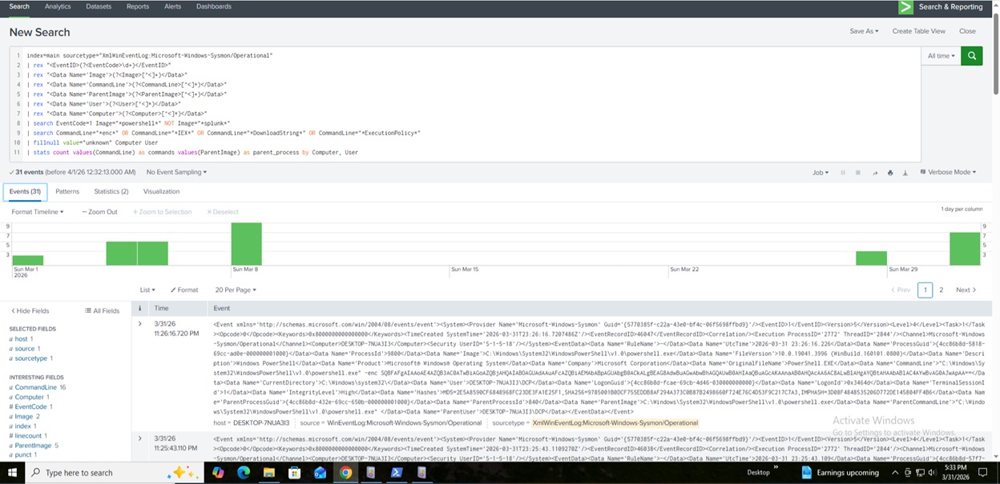
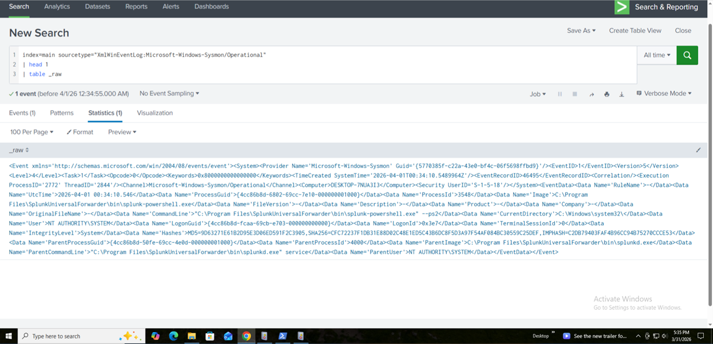

# Detection 01: Suspicious PowerShell Execution

> Detection of malicious PowerShell activity using behavioral analytics and Sysmon telemetry in Splunk.

## Problem Statement
PowerShell is commonly abused by attackers for fileless malware execution, privilege escalation, and command-and-control activities. Traditional signature-based detection often fails to identify obfuscated or encoded commands.

## Detection Objective
Develop a behavioral detection to identify suspicious PowerShell execution using Sysmon telemetry and Splunk SPL.

## Lab Environment

- Splunk Enterprise (SIEM)
- Sysmon (Endpoint Telemetry)
- Windows Test Machine
- Simulated attack commands


## Data Sources

- Sysmon Event ID 1 (Process Creation)
- Source Type: XmlWinEventLog:Microsoft-Windows-Sysmon/Operational

Fields extracted:
- Image
- CommandLine
- ParentImage
- User
- Computer

## Key Detection Features

- Behavioral detection (not signature-based)
- Identification of encoded and obfuscated commands
- Detection of in-memory execution techniques
- Noise reduction through process filtering
- Aggregation-based detection using `stats`


## Detection Engineering Process

## Step 1 — Validate Sysmon Logs

```spl
index=main sourcetype="XmlWinEventLog:Microsoft-Windows-Sysmon/Operational"
| rex "<EventID>(?<EventCode>\d+)</EventID>"
| stats count by EventCode

```



## Step 2 — Inspect Raw Logs

```spl
index=main sourcetype="XmlWinEventLog:Microsoft-Windows-Sysmon/Operational"
| head 5
```


## Step 3 — Field Extraction

```spl
index=main sourcetype="XmlWinEventLog:Microsoft-Windows-Sysmon/Operational"
| rex "<EventID>(?<EventCode>\d+)</EventID>"
| rex "<Data Name='Image'>(?<Image>[^<]+)</Data>"
| rex "<Data Name='CommandLine'>(?<CommandLine>[^<]*)</Data>"
| rex "<Data Name='ParentImage'>(?<ParentImage>[^<]+)</Data>"
| table _time EventCode Image CommandLine ParentImage
```


## Step 4 — Filter PowerShell Activity

This step isolates PowerShell executions from all process creation events.

```spl
index=main sourcetype="XmlWinEventLog:Microsoft-Windows-Sysmon/Operational"
| rex "<EventID>(?<EventCode>\d+)</EventID>"
| rex "<Data Name='Image'>(?<Image>[^<]+)</Data>"
| search EventCode=1 Image="*powershell*" NOT Image="*splunk*"
| table _time Image
```


## Step 5 — Detect Suspicious Behavior

```spl
index=main sourcetype="XmlWinEventLog:Microsoft-Windows-Sysmon/Operational"
| rex "<EventID>(?<EventCode>\d+)</EventID>"
| rex "<Data Name='Image'>(?<Image>[^<]+)</Data>"
| rex "<Data Name='CommandLine'>(?<CommandLine>[^<]*)</Data>"
| search EventCode=1 Image="*powershell*" NOT Image="*splunk*"
| search CommandLine="*enc*" OR CommandLine="*IEX*" OR CommandLine="*DownloadString*" OR CommandLine="*ExecutionPolicy*"
| table _time Computer User Image CommandLine ParentImage
```


## Step 6 — Final Detection Logic (Production Ready)

```spl
index=main sourcetype="XmlWinEventLog:Microsoft-Windows-Sysmon/Operational"
| rex "<EventID>(?<EventCode>\d+)</EventID>"
| rex "<Data Name='Image'>(?<Image>[^<]+)</Data>"
| rex "<Data Name='CommandLine'>(?<CommandLine>[^<]*)</Data>"
| rex "<Data Name='ParentImage'>(?<ParentImage>[^<]+)</Data>"
| rex "<Data Name='User'>(?<User>[^<]*)</Data>"
| rex "<Data Name='Computer'>(?<Computer>[^<]*)</Data>"
| search EventCode=1 Image="*powershell*" NOT Image="*splunk*"
| search CommandLine="*enc*" OR CommandLine="*IEX*" OR CommandLine="*DownloadString*" OR CommandLine="*ExecutionPolicy*"
| fillnull value="unknown" Computer User
| stats count values(CommandLine) as commands values(ParentImage) as parent_process by Computer, User

```




## Step 7 — Raw XML Event Analysis

```spl
index=main sourcetype="XmlWinEventLog:Microsoft-Windows-Sysmon/Operational"
| head 1
| table _raw
```




## Detection Rationale

PowerShell provides attackers with powerful capabilities for in-memory execution, making it a key tool for fileless attacks.

This detection focuses on identifying behavioral indicators such as:

- Encoded commands (-enc)
- Use of Invoke-Expression (IEX)
- Payload download techniques (DownloadString)
- Execution policy bypass attempts

These patterns are strongly associated with:
- Initial access
- Execution
- Command and control


## Detection Validation

This detection was validated using simulated attack commands:

- PowerShell encoded execution (-enc)
- ExecutionPolicy Bypass
- IEX (Invoke-Expression)
- DownloadString payload retrieval

All simulated attack behaviors were successfully detected.


## Noise Reduction

During analysis, Splunk internal processes were observed:

```spl
splunk-powershell.exe
splunk-netmon.exe
```

These were excluded using:

```spl
NOT Image="*splunk*"
```

This significantly reduced false positives.

## False Positive Considerations

Legitimate activities may trigger this detection:

- IT automation scripts
- Administrative PowerShell usage
- Software deployment tools

## Tuning Strategy
- Baseline normal PowerShell usage
- Exclude known administrative scripts
- Apply frequency-based filtering

Example:
```spl
| where count > 2
```

## MITRE ATT&CK Mapping

- T1059 — Command and Scripting Interpreter
- T1059.001 — PowerShell

## Detection Limitations

- Obfuscated commands may evade keyword-based detection
- Some attackers avoid common flags like -enc
- Script content is not analyzed (covered in 4104 detection)

## Outcome

Successfully detected multiple simulated attack scenarios involving PowerShell abuse while reducing false positives through filtering and tuning techniques.

## Future Improvements

- Integrate Script Block Logging (Event ID 4104)
- Detect obfuscated PowerShell payloads
- Correlate with network-based indicators

## Related Detections

- Detection 01 — PowerShell Execution Detection  
- Detection 02 — PowerShell Script Block Logging  